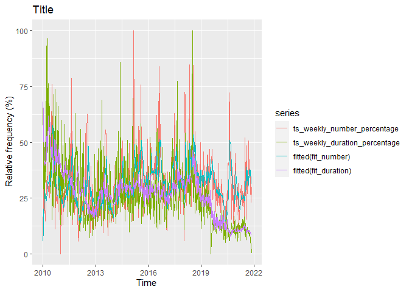

NYC 311 SERVICE REQUEST
================
Nuno Fernandes
31/10/2021

### Import Libraries

### read csv

``` r
df<-read.csv("C:\\Users\\nunok\\Documents\\Msc Data Science\\data_viz\\project\\Customer_Service_Module.csv")
```

# Preprocessing

### convert char to Date and create duration var

``` r
df$created_as_time <- parse_date_time(df$Created.Date, '%m/%d/%Y %I:%M:%S %p')
df$closed_as_time  <- parse_date_time(df$Closed.Date, '%m/%d/%Y %I:%M:%S %p')

df$duration_time   <- as.numeric(difftime(df$closed_as_time, df$created_as_time)) 
```

#### mean of duration to solve per day of the call

``` r
#created_as_time convert to Date
df$Date <- as.Date(df$created_as_time)


df%>%
  group_by(df$Date)%>%
  mutate(mean_duration = mean(duration_time, na.rm = T))%>%
  distinct(Date, .keep_all = T) -> df_ts
```

### time series incident resolution time

``` r
#time series of duration to solve per date
ts_a <- xts(x = df_ts$mean_duration, order.by = df_ts$Date)
```

### mean of duration until solved issue & number of calls per day

``` r
#if duration<0 => NA
df_ts2 <- df
df_ts2$duration_time[df_ts2$duration_time <0] <- NA


#created_as_time convert to Date
df_ts2$Date <- as.Date(df_ts2$created_as_time)

#compute mean duration & number of calls per day and filter
df_ts2%>%
  group_by(Date)%>%
  mutate(mean_duration = mean(duration_time, na.rm = T))%>%
  mutate(number = n())%>%
  distinct(Date, .keep_all = T) -> df_ts2

#to xts duration daily time series
ts_duration <- xts(x = df_ts2$mean_duration, order.by = df_ts2$Date)

#to xts number of call daily time series
ts_number <- xts(x = df_ts2$number, order.by = df_ts2$Date)
```

# Exploratory analysis

### convert xts to monthly ts time series

### convert to weekly time series

### find weeks that seem to be an outliers

``` r
#duration
#boxplot(ts_weekly_duration)
#tail(sort(ts_weekly_duration))
which(ts_weekly_duration==c(22030800, 29073600))
```

    ## Warning in `==.default`(ts_weekly_duration, c(22030800, 29073600)): longer
    ## object length is not a multiple of shorter object length

    ## [1] 499 500

``` r
#number
#boxplot(ts_weekly_number)
#head(sort(ts_weekly_number))
which(ts_weekly_number==1)
```

    ## [1] 498 499 500

### mean imputation(mean of previous and following week) & convert duration s to hr

``` r
#duration
ts_weekly_duration[c(499,500)] <- mean(ts_weekly_duration[c(498,501)])
ts_weekly_duration[325] <- mean(ts_weekly_duration[c(324,326)])

#mean
ts_weekly_number[c(498,499, 500)] <- mean(ts_weekly_number[c(497,501)])

#duration from s to hours
ts_weekly_duration <- ts_weekly_duration/3600
```

### plot

``` r
autoplot(cbind(ts_weekly_number,ts_weekly_duration))
```

<!-- -->

### to percentage

``` r
#duration
ts_weekly_duration_percentage <- ((ts_weekly_duration - min(ts_weekly_duration))/(max(ts_weekly_duration)-min(ts_weekly_duration)))*100

#number
ts_weekly_number_percentage <- ((ts_weekly_number - min(ts_weekly_number))/(max(ts_weekly_number)-min(ts_weekly_number)))*100
```

### auto-arima duration

``` r
fit_duration <- auto.arima(ts_weekly_duration_percentage)
checkresiduals(fit_duration)
```

<!-- -->

    ## 
    ##  Ljung-Box test
    ## 
    ## data:  Residuals from ARIMA(2,1,3)(2,0,0)[52]
    ## Q* = 113.72, df = 97, p-value = 0.118
    ## 
    ## Model df: 7.   Total lags used: 104

``` r
autoplot(fit_duration)
```

<!-- -->

``` r
#autoplot(forecast(fit))
plot(fit_duration$x)
lines(fitted(fit_duration),col="blue")
```

<!-- -->

### auto-arima number

``` r
# autoArima number
fit_number <- auto.arima(ts_weekly_number_percentage)
checkresiduals(fit_number)
```

<!-- -->

    ## 
    ##  Ljung-Box test
    ## 
    ## data:  Residuals from ARIMA(0,1,1)(0,0,1)[52] with drift
    ## Q* = 122.82, df = 101, p-value = 0.06903
    ## 
    ## Model df: 3.   Total lags used: 104

``` r
autoplot(fit_number)
```

<!-- -->

``` r
#autoplot(forecast(fit))
plot(fit_number$x)
lines(fitted(fit_number),col="blue")
```

<!-- -->

### Bind the two plots

``` r
autoplot(cbind(ts_weekly_number_percentage, ts_weekly_duration_percentage, fitted(fit_number), fitted(fit_duration) )) + ggtitle("Title") + labs(x = "Time", y= " Relative frequency (%)")
```

<!-- -->

``` r
number <- fitted(fit_number)
duration <-  fitted(fit_duration)

autoplot(cbind(number, duration)) + ggtitle("Weekly 311 calls") + labs(x = "Time", y= "Percentage of change") + scale_y_continuous(expand = c(0, 0), breaks = c(0,10,20,30,40,50,60,70)) + coord_cartesian(ylim=c(0, 70))+ theme(panel.grid.minor.y = element_blank(),
panel.grid.minor.x = element_blank(),panel.grid.major.x = element_blank() ) + theme(axis.line.x = element_line(colour = 'black', size=0.5, linetype='solid'),
                                               axis.line.y = element_line(colour = 'black', size=0.5, linetype='solid')) +     scale_x_continuous(n.breaks = 10)
```

<!-- -->

### ts to dataframe

``` r
#ts to dataframe
df_duration <- fortify(ts_weekly_duration)
df_number <- fortify(ts_weekly_number)

#df to ts
ts_duration <- ts(df_duration)
ts_number <- ts(df_number)
```

### Why this decreasing trend in the duration since covid? Inspect number of cases/type and duration per case

### When was this sudden rise in calls?

``` r
#summary(df_ts2$number)
which(df_ts2$number>=3570)
```

    ## [1] 2962

``` r
df_ts2[2875,"Date"]
```

    ## # A tibble: 1 x 1
    ## # Groups:   Date [1]
    ##   Date      
    ##   <date>    
    ## 1 2020-02-21

\#seasonal plot

``` r
ggmonthplot(ts_monthly_duration)+
  ylab("duration") +
  ggtitle("Seasonal plot: duration ")
```

<!-- -->

``` r
ggmonthplot(ts_monthly_number)+
  ylab("number") +
  ggtitle("Seasonal plot: number ")
```

<!-- -->

# weekly plot of n() Water Quality

``` r
df_water = subset(df, Complaint.Type == "Water Quality")

df_water%>%
  group_by(Date)%>%
  mutate(number = n())%>% 
  distinct(Date, .keep_all = T) -> df_water_

ts_water_ <- xts(x = df_water_$number, order.by = df_water_$Date)

ts_weekly_water <- to.weekly(ts_water_)
ts_weekly_water <- xts_to_ts(ts_weekly_water)
```

    ## Warning in xts_to_ts(ts_weekly_water): The "xts.obj" has multiple columns, only
    ## the first will be convert to 'ts' object

``` r
autoplot(ts_weekly_water) +  ggtitle("Weekly 311 Water Quality Complaints") + labs(x = "Year", y= "Number") + scale_y_continuous(expand = c(0, 0), breaks = c(0,10,20,30,40,50)) + coord_cartesian(ylim=c(0, 60))+ theme(panel.grid.minor.y = element_blank(),
panel.grid.minor.x = element_blank(),panel.grid.major.x = element_blank() ) + theme(axis.line.x = element_line(colour = 'black', size=0.5, linetype='solid'),
                                               axis.line.y = element_line(colour = 'black', size=0.5, linetype='solid')) +     scale_x_continuous(n.breaks = 10) + geom_line(colour = "darkgoldenrod")
```

    ## Scale for 'x' is already present. Adding another scale for 'x', which will
    ## replace the existing scale.

<!-- --> \# weekly plot
of n() noise

``` r
df_water = subset(df, Complaint.Type == "Noise")

df_water%>%
  group_by(Date)%>%
  mutate(number = n())%>% 
  distinct(Date, .keep_all = T) -> df_water_

ts_water_ <- xts(x = df_water_$number, order.by = df_water_$Date)

ts_weekly_water <- to.weekly(ts_water_)
ts_weekly_water <- xts_to_ts(ts_weekly_water)
```

    ## Warning in xts_to_ts(ts_weekly_water): The "xts.obj" has multiple columns, only
    ## the first will be convert to 'ts' object

``` r
autoplot(ts_weekly_water) +  ggtitle("Weekly 311 Noise complaints") + labs(x = "Year", y= "Number") + scale_y_continuous(expand = c(0, 0), breaks = c(0,50,100,150,200,250)) + coord_cartesian(ylim=c(0, 300))+ theme(panel.grid.minor.y = element_blank(),
panel.grid.minor.x = element_blank(),panel.grid.major.x = element_blank() ) + theme(axis.line.x = element_line(colour = 'black', size=0.5, linetype='solid'),
                                               axis.line.y = element_line(colour = 'black', size=0.5, linetype='solid')) +     scale_x_continuous(n.breaks = 7) + geom_line(colour = "blueviolet")
```

    ## Scale for 'x' is already present. Adding another scale for 'x', which will
    ## replace the existing scale.

<!-- -->
